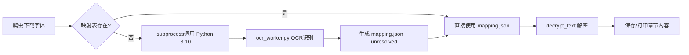

字体 OCR 字符映射提取工具 使用文档
====================

一、工具概述
------

本工具用于**自动提取字体文件中的字符映射关系**，结合 PaddleOCR 自动识别 + 人工复核修正，输出精准的字体 Unicode 码点与文字映射表，适用于字体反爬、字体解析等场景。

工具包含两个核心脚本：

1. `ocr_worker.py`：全自动字体字符 OCR 识别，拆分高置信度映射和待复核字符
2. `resolve_unresolved.py`：人工复核后，合并修正结果，更新映射表

* * *

二、运行环境
------

### 1. 脚本通用环境

* Python 版本：**3.6+**
* 依赖：仅使用 Python 标准库，**无额外第三方依赖**

### 2. ocr_worker.py 专用环境

* Python 版本：**必须使用 3.10**（Python 3.13 不兼容 PaddleOCR）
* 第三方依赖：PaddleOCR
* 推荐使用虚拟环境（conda/venv）隔离环境

#### 环境要求

| 脚本                         | Python 版本 | 必需依赖                                                                                              |
| -------------------------- | --------- | ------------------------------------------------------------------------------------------------- |
| `18-千机变.py`                | 3.13      | `requests`, `parsel`, `asyncio`                                                                   |
| **`ocr_worker.py` (GPU版)** | 3.10      | `paddlepaddle-gpu`, `paddleocr`, `Pillow`, `fontTools`, `numpy`<br>**及 NVIDIA GPU 驱动、CUDA、cuDNN** |
| `resolve_unresolved.py`    | 3.6+      | 无（仅标准库）                                                                                           |

> **注意**：PaddleOCR 暂不支持 Python 3.13，因此必须隔离环境。以下指南以 GPU 加速为例，若无需 GPU 可跳过 CUDA/cuDNN 部分。

#### 安装与配置

##### 1. 前置准备 (GPU 加速必须)

在开始前，请确保系统满足以下条件：

- **NVIDIA 显卡**：需要一块支持 CUDA 的 NVIDIA 显卡

- **显卡驱动**：请从 NVIDIA 官网下载并安装适用于您显卡型号的最新驱动程序

- **Visual Studio (MSVC)**：部分依赖需要 C++ 编译环境。建议安装 Visual Studio 2019 或 2022，或仅安装 Visual C++ Build Tools

- **CUDA 与 cuDNN**：PaddlePaddle 需要特定版本的 CUDA 和 cuDNN。推荐安装 **CUDA 11.8** 和 **cuDNN 8.9
  
  - `CUDA Toolkit` 可从 NVIDIA 官网下载安装[]
  
  - `cuDNN` 需登录 NVIDIA 开发者账号后从官网下载，并按官方指南将文件复制到 CUDA 安装目录
  
  - **版本对应关系**：请务必严格遵照对应版本的安装说明。

- **注意**：对于 **NVIDIA 50 系列显卡**的 Windows 用户，标准 PaddlePaddle 包可能不兼容，需要安装官方提供专门适配的安装包

#### 2. 创建 Python 3.10 环境（用于 OCR）

```bash
# 创建并激活 conda 环境
conda create -n paddle_gpu python=3.10
conda activate paddle_gpu

# 选择对应你 CUDA 版本的 paddlepaddle-gpu 进行安装（此处以 CUDA 11.8 为例）
# 具体版本请参考 PaddlePaddle 官网
pip install paddlepaddle-gpu==3.0.0 -i https://www.paddlepaddle.org.cn/packages/stable/cu118/

# 验证 GPU 环境是否安装成功
python -c "import paddle; print(paddle.is_compiled_with_cuda())"
# 若输出 True，则说明 GPU 环境配置成功

# 安装 PaddleOCR 及相关依赖
pip install paddleocr Pillow fontTools numpy
```

#### 3. 创建 Python 3.13 环境（用于爬虫）

```bash
conda create -n crawler python=3.13
conda activate crawler
pip install requests parsel
```

#### 4. 配置爬虫中的 Python 3.10 解释器路径

打开 `18-千机变.py`，修改 `PY310_PATH` 为你的实际路径：

```python
PY310_PATH = r"D:\Miniconda3\envs\paddle_gpu\python.exe"    # paddle_gpu 环境中的 python.exe
```


* * *

三、脚本功能与参数说明
-----------

### 1. ocr_worker.py

#### 功能

遍历字体文件所有字符，渲染为图片后通过 PaddleOCR 识别：

* 置信度 ≥ 0.99：自动保存为**确定映射表**（JSON）
* 置信度 < 0.99 / 未识别：保存为**未确定记录**（图片 + JSON），用于人工复核

#### 使用示例

##### 方式一：全自动爬虫（推荐）

直接运行爬虫主程序，它会自动：

1. 遍历章节目录

2. 下载每个章节对应的字体文件

3. 若映射表不存在，则自动调用 `ocr_worker.py`（通过 `subprocess` 在 Python 3.10 环境中运行）

4. 使用生成的映射表解密章节内容

5. 输出解密后的文本

```bash
conda activate crawler
python 18-千机变.py
```

> 运行时，控制台会同时显示爬虫日志和 OCR 处理进度（来自 Python 3.10 子进程）。

##### 方式二：手动 OCR 处理单个字体文件

如果你只想单独处理一个字体文件，不运行爬虫，可以在终端直接调用 `ocr_worker.py`：

```bash
conda activate paddle_gpu
python ocr_worker.py --font_path ./fonts/example.woff2 \
                     --mapping_path ./fonts/example.mapping.json \
                     --unresolved_dir ./fonts/example_unresolved
```

参数说明：

| 参数                 | 必填  | 说明                       |
| ------------------ | --- | ------------------------ |
| `--font_path`      | 是   | 字体文件路径（.ttf/.woff2/.otf） |
| `--mapping_path`   | 是   | 输出映射表 JSON 路径            |
| `--unresolved_dir` | 是   | 未确定字符保存目录（自动创建）          |

输出文件：

* `{mapping_path}`：确定字符映射表（置信度 ≥ 0.99），格式 `{"0x4e00": "一", ...}`

* `{unresolved_dir}/unresolved.json`：未确定字符信息

* `{unresolved_dir}/*.png`：每个未确定字符的渲染图片

文件格式：

1. `{mapping_path}`：确定映射表，格式：
   
   ```json
    {
    "0x4e00": "一",
     "0x4e8c": "丁"
    }
   ```
   
   

2. `{unresolved_dir}/unresolved.json`：未确定字符信息，格式：
   
   ```json
    { 
    "0x4e00": {
        "name": "uni4E00",
        "recognized": "",
        "score": 0.45
        }
    }
   ```

3. `{unresolved_dir}/*.png`：未确定字符渲染图片（文件名 = Unicode 码点，如 `0x4e00.png`）

工作原理：



### 2. resolve_unresolved.py

#### 功能

读取未确定字符 JSON 和确定映射表，将**已手动填写正确文字**的条目合并到确定映射表，并从未确定列表中删除。

#### 参数说明

表格

| 参数名              | 必需  | 类型  | 说明                            |
| ---------------- | --- | --- | ----------------------------- |
| --unresolved_dir | 是   | 字符串 | 未确定字符目录（必须包含 unresolved.json） |
| --mapping_path   | 是   | 字符串 | 确定映射表路径（直接在原文件更新）             |

#### 使用示例

```bash
python resolve_unresolved.py --unresolved_dir ./output/unresolved --mapping_path ./output/determined_mapping.json
```

* * *

四、完整工作流程（必看）
------------

### 步骤 1：运行 OCR 初步识别

1. 切换到 Python 3.10 虚拟环境
2. 执行 `ocr_worker.py` 全自动识别

```bash
# 激活虚拟环境（二选一）
conda activate py310
# source venv310/bin/activate

# 运行脚本
python ocr_worker.py --font_path font.woff2 --mapping_path mapping.json --unresolved_dir ./unresolved
```

执行后得到两个输出：

* `mapping.json`：高置信度自动识别映射（可直接使用）
* `unresolved/`：待复核图片 + `unresolved.json`

* * *

### 步骤 2：人工复核未确定字符

1. 打开 `unresolved/unresolved.json`
2. 对照目录下的 PNG 图片，判断字形对应的正确文字
3. 将正确文字填入 `recognized` 字段

示例（修正前 → 修正后）：

```json
// 修正前
"0x4e00": {"name": "uni4E00", "recognized": "", "score": 0.45}

// 修正后
"0x4e00": {"name": "uni4E00", "recognized": "一", "score": 0.45}
```

* 无法辨认的字符：`recognized` 保持空字符串即可

* * *

### 步骤 3：合并修正后的字符

任意 Python 环境运行合并脚本，自动更新映射表：

```bash
python resolve_unresolved.py --unresolved_dir ./unresolved --mapping_path mapping.json
```

#### 输出示例

```textile
成功合并 42 个字符到 mapping.json
未确定字符剩余数量: 17
未解决条目仍保存在 ./unresolved/unresolved.json
```

* * *

### 步骤 4（可选）：重复复核 + 合并

对剩余未确定字符，重复**步骤 2、步骤 3**，直到 `unresolved.json` 清空为止。

* * *

五、注意事项
------

1. **字体处理耗时**：中文字体含数万个字符，处理可能耗时数小时，建议使用 GPU 加速（脚本默认启用 `device="gpu:0"`）

2. **Python 版本严格区分**：
   
   * `ocr_worker.py`：必须 Python 3.10
   * `resolve_unresolved.py`：Python 3.6+ 均可

3. **图片渲染优化**：识别效果不佳时，可调整脚本中 `size=120`、图片尺寸、文字坐标偏移

4. **JSON 编码**：所有文件使用 UTF-8 编码，中文无乱码

5. **JSON 格式规范**：手动编辑时请勿添加语法错误（推荐 VS Code 编辑）

6. **多字体处理**：为每个字体创建独立输出目录，避免文件覆盖

* * *

六、常见问题
------

### Q1：运行 ocr_worker.py 提示 No module named 'paddleocr'

**解决**：确认环境为 Python 3.10，执行安装命令：

```bash
pip install paddleocr
```

### Q2：合并后 unresolved.json 条目未减少

**解决**：检查 `recognized` 字段是否**非空、非空格**，空值会被脚本忽略。

### Q3：映射表出现重复 Unicode 码点

**解决**：脚本使用 `dict.update()` 合并，**人工修正结果会覆盖自动识别结果**（以人工为准）。

### Q4：字符图片偏斜，OCR 识别不准

**解决**：调整 `ocr_worker.py` 中渲染参数：字体大小、图片尺寸、文字绘制坐标。

### Q5：运行时提示 `FileNotFoundError: ocr_worker.py`

**解决**：请将 `ocr_worker.py` 放在与 `18-千机变.py` 相同的目录，或修改 `WORKER_SCRIPT` 的绝对路径

### Q6：解密后仍然是乱码（私有区字符）

**解决**：可能原因：

* 映射表与加密文本中的私有区码点不匹配（字体文件版本不一致）。

* 未确定字符尚未人工修正。  
  
  解决办法：运行 `resolve_unresolved.py` 合并手动修正的字符，或检查 `ocr_worker.py` 中提取 cmap 的方式（尝试使用 `font['cmap'].getcmap(3, 1).cmap`）。

### Q7：OCR 处理很慢，能否加速？

**解决**：确保使用 GPU（已在 `ocr_worker.py` 中设置 `device="gpu:0"`）。若只有 CPU，可降低 `text_det_limit_side_len` 等参数，或减少字体渲染尺寸（`size=120`）。

### Q8：确认识别错误

> 请注意中文字符`'`的正反区别

| 真实字符 | 识别字符 |
| ---- | ---- |
| ‘    | ，    |
| ”    | “    |
| ‘    | 6    |

许可证
---

本项目仅用于学习和研究，请勿用于非法用途。
